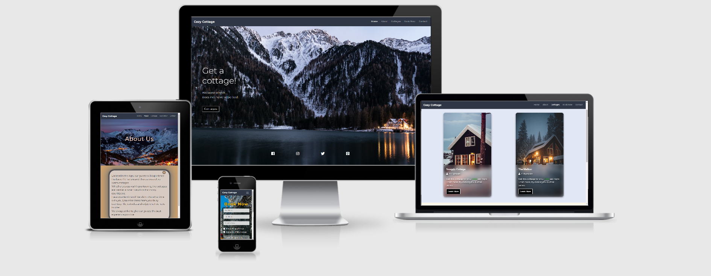

<h1 align="center">Cozy Cottage</h1>

This is a website, where users can book a Cottage.

Site's purpose is to help users book their next holiday and enjoy their time off, at a nice and warm Cottage.

## UX

### User Stories

-   #### First Time Visitor Goals

    As a first time user I would like to:

    1. Be able to clearly understand the purpose of the site.

    2. Be able to navigate easily through the website.

    3. Find more information about the site.

    4. See what features the site offers.
   

-   #### Returning Visitor Goals

    As a returnig user, I would like to:

    1. See images of cottages on the inside and out.

    2. Find a booking form and contact form.

    3. Be able to choose start date and end date of my holiday.

    4. See how much would it cost to rent a cottage.

    5. Get the location of the place.

    6. Find social media links.

-   #### Frequent User Goals

    As a frequent user I would like to:

    1. See if, there are any new offers currently on.

    2. See if, there are any layout changes and if the site is still easy to navigate after.

-   ### Design

    -   #### Colour Scheme

        - Main colours used are "Black, White, Orange, Blue"

        - Contact page background from [CSS Gradient](https://cssgradient.io/gradient-backgrounds/)

    -   #### Typography

        - The Robboto and Montserrat and the two fonts I have used, with Sans Serif used as a fallback.

    -   #### Images

        - Used images from [Unsplash](https://unsplash.com) and [Pexels](https://www.pexels.com) and credited in [Credits](#credits) section.

-   ### Wireframes

    -   #### Mobile:

        1. [Home](https://github.com/steff880/MS2-project-Cottage/blob/master/assets/wireframes/mobile/ms2-mobile-home-wireframes.png)

        2. [About](https://github.com/steff880/MS2-project-Cottage/blob/master/assets/wireframes/mobile/ms2-mobile-about-wireframes.png)

        3. [Cottages](https://github.com/steff880/MS2-project-Cottage/blob/master/assets/wireframes/mobile/ms2-mobile-cottages-wireframes.png)

        4. [Book Now](https://github.com/steff880/MS2-project-Cottage/blob/master/assets/wireframes/mobile/ms2-mobile-book-now-wireframes.png)

        5. [Contact](https://github.com/steff880/MS2-project-Cottage/blob/master/assets/wireframes/mobile/ms2-mobile-contact-wireframes.png)

    -   #### Tablet:

        1. [Home](https://github.com/steff880/MS2-project-Cottage/blob/master/assets/wireframes/tablet/ms2-tablet-home-wireframes.png)

        2. [About](https://github.com/steff880/MS2-project-Cottage/blob/master/assets/wireframes/tablet/ms2-tablet-about-wireframes.png)

        3. [Cottages](https://github.com/steff880/MS2-project-Cottage/blob/master/assets/wireframes/tablet/ms2-tablet-cottages-wireframes.png)

        4. [Book Now](https://github.com/steff880/MS2-project-Cottage/blob/master/assets/wireframes/tablet/ms2-tablet-book-now-wireframes.png)

        5. [Contact](https://github.com/steff880/MS2-project-Cottage/blob/master/assets/wireframes/tablet/ms2-tablet-contact-wireframes.png)

    -   #### Desktop:

        1. [Home](https://github.com/steff880/MS2-project-Cottage/blob/master/assets/wireframes/desktop/ms2-desktop-home-wireframes.png)

        2. [About](https://github.com/steff880/MS2-project-Cottage/blob/master/assets/wireframes/desktop/ms2-desktop-about-wireframes.png)

        3. [Cottages](https://github.com/steff880/MS2-project-Cottage/blob/master/assets/wireframes/desktop/ms2-desktop-cottages-wireframes.png)

        4. [Book Now](https://github.com/steff880/MS2-project-Cottage/blob/master/assets/wireframes/desktop/ms2-desktop-book-now-wireframes.png)

        5. [Contact](https://github.com/steff880/MS2-project-Cottage/blob/master/assets/wireframes/desktop/ms2-desktop-contact-wireframes.png)

---

## Features

The website consists of 5 pages. All accessible from navigation menu.

## Navigation Bar

* Navigation bar is fixed to the top of each page, which gives the user the option to return,
    or move to another page easily. It will adapt to mobile devices by changing into a burger menu.

* Navigation:

    - On the left there is the site's logo, which can be used to navigate to **Home** page at any moment.
    - On the right side there are 5 links to each page. If viewed on mobile device, those will drop down,
        when clicked on burger menu.

### Home page

- User is greeted with welcome animation
- Has a background image and also greeting text, and a button to navigate to **Cottages** page.

### About

- Has an image and about us information.

### Cottages

- Has two cards with images of cottages, text and button to learn more. 
    When the user clicks learn more button, there will be displayed more information of the cottages and 
    also a carousel with images. Under each carousel there is a button which will take the user to Book Now page.
    Also there is google maps, which helps the user to see where the Cottages are located.

### Book Now

- This pages has a background image and a form where the user can fill in there details and choose 
    when to visit. Also a book now button.

### Contact

- This page has a form and buttons submit and reset.

### Footer

- Each page has Footer with social links.

#### Features Left to Implement 

-   Add Attractions section, where user can find all the Attractions provided and choose to take advantage.
-   Add Login/Register section.
-   Add more Cottages with different options.
-   Add different locations.
---

## Technologies Used

### Languages Used

-   [HTML5](https://en.wikipedia.org/wiki/HTML5)
-   [CSS3](https://en.wikipedia.org/wiki/CSS)
-   [JavaScript](https://en.wikipedia.org/wiki/JavaScript)

### Frameworks, Libraries & Programs Used

1. [Bootstrap v4.5.3:](https://getbootstrap.com/docs/4.5/getting-started/introduction/)
    - Bootstrap was used to assist with the responsiveness and styling of the website.
1. [Google Fonts:](https://fonts.google.com/)
    - Google fonts were used to import the "Lato" font into the style.css file which is used on all pages throughout the project.
1. [Font Awesome:](https://fontawesome.com/)
    - Font Awesome was used to add icons to the site.
1. [jQuery:](https://jquery.com/)
    - jQuery came with Bootstrap
1. [Git](https://git-scm.com/)
    - Git was used for version control by utilizing the Gitpod terminal to commit to Git and Push to GitHub.
1. [GitHub:](https://github.com/)
    - GitHub is used to store the project's code after being pushed from Git.
1. [Balsamiq:](https://balsamiq.com/)
    - Balsamiq was used to create the [Wireframes](#wireframes) during the design process.

1. [Gsap Green Sock](https://greensock.com/gsap/) 
    - JavaScript animation library used to help with the animations.

1. [Autoprefixer](https://autoprefixer.github.io/)    
    - Adds vendor prefixes.

1. [Grammarly](https://app.grammarly.com/ddocs/1018809008)
    - Used to help with grammar checks.

---

## Resources

- [Code Institute Course Content](https://courses.codeinstitute.net/)

- [Stack Overflow](https://stackoverflow.com/) - General resource

- [YouTube](https://www.youtube.com/) - General resource

- [Am I Responsive](http://ami.responsivedesign.is/) - Responsive website mockup image generator

- [Dev Ed](https://www.youtube.com/channel/UClb90NQQcskPUGDIXsQEz5Q) - Help with JS animation tutorial

## Bugs and Fixes

-   ### Bug

1. Issue with height on element with class "container-about-content", where it's child element was overflowing.
    In result the background-color aplied did not cover the child element.

2. Issue with the width of the cards on Cottages page because of inline styling which came with bootsrap code.

3. Issue with social links on Home page. On mobile view icons align on the left and did not look the same as on larger screens.

4. Issue with image on the cards of Cottages page. Image being streched when viewed on Iphone 5SE.

-   ### Fix

1.  Add the code:
        
         html{
             height: 100%;
        } 

        body {
            min-height: 100vh;
        }

        .container-about-content {
            min-height: 50vh;
        }

2.  Remove the inline styling and add custom one.        

3. Fixed issue by positioning the icons at the bottom center of the page instead of left. To achieve this adedd properties to the parent element
     and amended the properties of the child element.

4. Fix issue by removing "_margin: 0 auto;_" from class **_card-row_** and add "_margin-left and margin-right -10px_" to the same class and to the 
    **_cottages-heading-container_**, also reduce the padding of **_cottages-container_** from 15px to 10px. 
    Also add media qiery for xs devices and change the "_height_" of the class **_card-cottages_** form 650px to 600px.
    Please note that the orientation of the images on the cards is **Portrait** not **Landscape** ! 
## Testing
### W3C Validator Testing

The W3C Markup Validator and W3C CSS Validator Services were used to validate every page of the project to ensure there were
no syntax errors in the project.

[W3C Markup Validator](https://validator.w3.org/)

-   No errors found [View results here](https://validator.w3.org/nu/?doc=https%3A%2F%2Fsteff880.github.io%2FMS2-project-Cozy-Cottage%2F)

[W3C CSS Validator](https://jigsaw.w3.org/css-validator/)

- One error found - Property backdrop-filter doesn't exist : blur(14px);. I used this property to add 
    blurred effect on the cards behind the text. Used in Cottages page. Could not find a way around it.
- Warnings are either from vendor prefixes or bootstrap.

### [JSHint](https://jshint.com/)

-  Testing home.js: 

    - Result - One warning for _const_ 

-   Testing cottages.js:

    - Result - Eight warnings for _let_

-   Testing book-now.js:

    - Result - Seven warnings for _let_

-   Testing contact.js:

    - Result - Ten warnings for using _const_ and _let_
    
    - **Please note that code for text animation has few global variables. Code taken from 
        external resource and done exactly as shown on the [tutorial](https://www.youtube.com/watch?v=GUEB9FogoP8), in oreder to keep functionality and 
        only names of the variables are changed to fit project needs.**

### Testing User Stories

  #### First Time Visitor Goals

- Be able to clearly understand the purpose of the site.

    - When first entering the website users are greeted with a welcome animation, 
        followed by a image of cottages in snowy environment. Also button which can take the to Cottages page.
    The main points are made immediately on the Home page as to the site's purpose.

- Be able to navigate easily through the website

    - User can navigate to any page of the site at any moment due to fixed navigation bar. 

- Find more information about the site

    - Users can find more information when navigating to About page.

#### Testing Navigation

<table>
    <tr>
        <th>Test</th>
        <th>Expected Outcome</th>
        <th>Result</th>
    </tr>
    <tr>
        <td>Home</td>
        <td>When clicked on Home, takes us to Home page</td>
        <td>Pass</td>
    </tr>
    <tr>
        <td>About</td>
        <td>When clicked on About, takes us to About page</td>
        <td>Pass</td>
    </tr>
    <tr>
        <td>Cottages</td>
        <td>When clicked on Cottages, takes us to Cottages page</td>
        <td>Pass</td>
    </tr>
    <tr>
        <td>Book Now</td>
        <td>When clicked on Book Now, takes us to Book Now page</td>
        <td>Pass</td>
    </tr>
    <tr>
        <td>Contact</td>
        <td>When clicked on Contact, takes us to Contact page</td>
        <td>Pass</td>
    </tr>
</table>

#### Testing Buttons

<table>
    <tr>
        <th>Test</th>
        <th>Expected Outcome</th>
        <th>Result</th>
    </tr>
    <tr>
        <td>Cottages Button</td>
        <td>When clicked on Cottages button, takes us to Cottages page</td>
        <td>Pass</td>
    </tr>
    <tr>
        <td>Learn More</td>
        <td>When clicked on Learn More on Cottages page, expect to see more information displayed on screen</td>
        <td>Pass</td>
    </tr>
    <tr>
        <td>Book Now</td>
        <td>When clicked on Book Now on Cottages page, takes us to Book Now page</td>
        <td>Pass</td>
    </tr>
    <tr>
        <td>Book Now</td>
        <td>When clicked on Book Now on the book now form, submit form</td>
        <td>Pass</td>
    </tr>
    <tr>
        <td>Submit</td>
        <td>When clicked on Submit on Contact page, submit form</td>
        <td>Pass</td>
    </tr>
    <tr>
        <td>Reset</td>
        <td>When clicked on Reset, clear all input fields</td>
        <td>Pass</td>
    </tr>
</table>

#### Testing Social Links

<table>
    <tr>
        <th>Test</th>
        <th>Expected Outcome</th>
        <th>Result</th>
    </tr>
    <tr>
        <td>Facebook</td>
        <td>When clicked on Facebook, open link in new tab</td>
        <td>Pass</td>
    </tr>
    <tr>
        <td>Instagram</td>
        <td>When clicked on Instagram, open link in new tab</td>
        <td>Pass</td>
    </tr>
    <tr>
        <td>Twitter</td>
        <td>When clicked on Twitter, open link in new tab</td>
        <td>Pass</td>
    </tr>
    <tr>
        <td>Pinterest</td>
        <td>When clicked on Pinterest, open link in new tab</td>
        <td>Pass</td>
    </tr>   
</table>

#### Testing site's responsiveness

<table>
    <tr>
        <th>Test</th>
        <th>Expected Outcome</th>
        <th>Result</th>
    </tr>
    <tr>
        <td>Mobile</td>
        <td>Site is  responsive on mobile devices</td>
        <td>Pass</td>
    </tr>
    <tr>
        <td>Tablet</td>
        <td>Site is responsive on tablet devices</td>
        <td>Pass</td>
    </tr>
    <tr>
        <td>Desktop</td>
        <td>Site is responsive when viewed on large screen devices</td>
        <td>Pass</td>
    </tr>
</table>

### Additional Testing

-   Laptop & Desktop

    -   Chrome

        -   All tested and working fine

    -   Edge

        -   All tested and working fine

    -   Opera

        -   All tested and working fine

    -   Firefox

        -  When tested on Firefox found the following error:
            
            - On Cottages page the property backdrop-filter: blur(14px); doesn't work. 
                Due to this, the background of the card body is not blured. It does not affect readability and still looks good.

    -   Internet Explorer

        -   When tested on this browser found the following errors:

            - Home page:

                - Text is pushed to the left. Also the transition efect on the social links does not work 
                    propperly.

            -   About page:

                - The layout is broken. Text is squeezed in the middle of the screen. Also the background colour is gone 
                    and social link are pushed to the left.

            -   Cottages page:

                - Cards are pushed to the left. The card body is squeezed to the right of the card.
                    Social links pushed to the left.        

            - Book Now page:

                - Form and input background is does not exist. Social links pushed to the left.        

            - Contact page:

                - Form and heading slightly pushed up and social links to the left. Also submit button has no background.
           

    -   Tested on Chrome using different devices via google chrome device emulators and all works fine.
    -   Also tested on the following physical mobile devices:

        1.  Samsung Galaxy S9 plus and works fine

        2.  Samsung Galaxy s8 and works fine

        3.  Huawei P30 and works fine

---

## Deployment

### GitHub Pages

-   Following steps were used:

    1. First login to [GitHub](https://github.com/)
    2. Locate the **Repository** and click on settings.
    3. Scroll down the settings page till you see GitHub Pages.
    4. Then under source choose **_master_** branch by clicking the button.
    5. Click Save and wait for the page to refresh.
    6. Scroll down again to GitHub pages.
    7. Find the URL for the site under GitHub pages.

### Fork It

1. Login to [GitHub](https://github.com/)
2. Locate the **Repository**.
3. In the top right corner click **_Fork_** button.

### Clone It

1. Login to [GitHub](https://github.com/)
2. Fork the Repository.
3. Then click **Code** under the _Settings_ button.
4. Choose HTTPS, SSH, or GitHub CLI, then click the copy button to the right.
5. Open Git Bash
6. Change the directory to the location where you want the cloned directory to be made.
7. Type _git clone_ and paste the URL you copied before.
8. To create the clone press _Enter_

---

## Credits

### Imges 

- Home

    - [Photo by eberhard grossgasteiger](https://unsplash.com/photos/mWuXdxtesG0)

- About

    - [Remi Antunes](https://unsplash.com/photos/8N7Q_HtAO78)

- Cottages

    - [Bryan Walker](https://unsplash.com/photos/F3eMW1OLC24)

    - [Brad Pearson](https://unsplash.com/photos/rySQ5G6EbgI)

    - [Photo by Vecislavas Popa from Pexels](https://www.pexels.com/photo/cabinet-ceiling-clean-comfort-1669799/)

    - [Photo by Home Decor Interiors from Pexels](https://www.pexels.com/photo/flat-screen-television-1827054/)

    - [Photo by R ARCHITECTURE on Unsplash](https://unsplash.com/photos/TRCJ-87Yoh0)

    - [Photo by Terry Magallanes from Pexels](https://www.pexels.com/photo/four-brown-wooden-chairs-2635038/)

    - [Photo by House Method on Unsplash](https://unsplash.com/photos/CqVHT8g45R8)

    - [Photo by Sidekix Media on Unsplash](https://unsplash.com/photos/mIurtZy_5RE)

    - [Photo by Adam Winger on Unsplash](https://unsplash.com/photos/b87_egH5mos)

    - [Photo by Sidekix Media on Unsplash](https://unsplash.com/photos/f1Rd2HsoKnk)

    - [Photo by Sidekix Media on Unsplash](https://unsplash.com/photos/g51F6-WYzyU)

    - [Photo by Ronnie George on Unsplash](https://unsplash.com/photos/m78oBvRHBm0)

   

- Book Now

    - [Photo by Robson Hatsukami Morgan on Unsplash](https://unsplash.com/photos/5C6veSN6hec)
